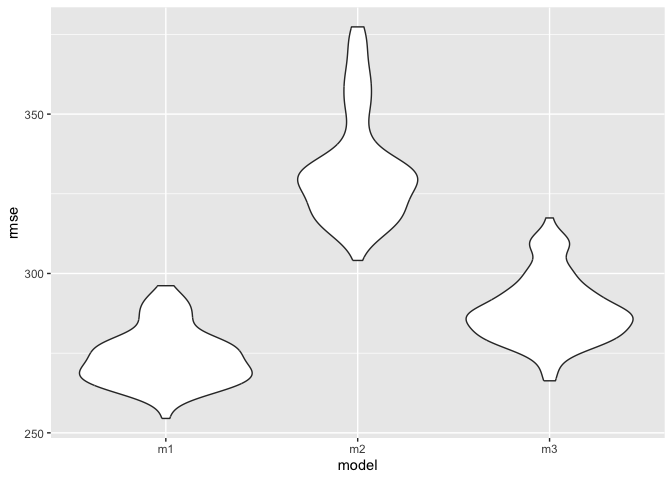

HW6
================
Kimberly Lopez
2024-11-24

# Problem 1

Load the data

``` r
weather_df = 
  rnoaa::meteo_pull_monitors(
    c("USW00094728"),
    var = c("PRCP", "TMIN", "TMAX"), 
    date_min = "2017-01-01",
    date_max = "2017-12-31") %>%
  mutate(
    name = recode(id, USW00094728 = "CentralPark_NY"),
    tmin = tmin / 10,
    tmax = tmax / 10) %>%
  select(name, id, everything())
```

    ## using cached file: /Users/kimlopez/Library/Caches/org.R-project.R/R/rnoaa/noaa_ghcnd/USW00094728.dly

    ## date created (size, mb): 2024-09-26 10:19:32.377321 (8.651)

    ## file min/max dates: 1869-01-01 / 2024-09-30

``` r
n_bootstrap = 5000

bootstrap_results = 
  replicate(n_bootstrap, {
    bootstrap_sample= sample_n(weather_df, nrow(weather_df), replace = TRUE)
    
    model= lm(tmax ~ tmin, data = bootstrap_sample)
})
```

# Problem 2

Import data. Create a city_state variable (e.g. “Baltimore, MD”), and a
binary variable indicating whether the homicide is solved. Omit cities
Dallas, TX; Phoenix, AZ; and Kansas City, MO – these don’t report victim
race. Also omit Tulsa, AL – this is a data entry mistake. For this
problem, limit your analysis those for whom victim_race is white or
black. Be sure that victim_age is numeric.

- open case: 0
- closed case: 1

``` r
homicide_data = 
  read_csv("data/homicide-data.csv")|>
  janitor::clean_names()|>
  mutate(
    city_state = paste(city,state, sep=", "),
    status_bin= ifelse(disposition=="Open/No arrest", 0, 1), 
    victim_race = fct_relevel(victim_race, "White"), 
    victim_sex = fct_relevel(victim_sex, "Female")
  )|>
  filter(!city_state %in% c("Dallas, TX", "Phoenix, AZ", "Kansas City, MO", "Tulsa, AL"))|>
  filter(victim_race =="White" | victim_race =="Black"  )|>
  filter(!victim_age =="Unknown")|>
  mutate(victim_age = as.numeric(victim_age))
```

    ## Rows: 52179 Columns: 12
    ## ── Column specification ────────────────────────────────────────────────────────
    ## Delimiter: ","
    ## chr (9): uid, victim_last, victim_first, victim_race, victim_age, victim_sex...
    ## dbl (3): reported_date, lat, lon
    ## 
    ## ℹ Use `spec()` to retrieve the full column specification for this data.
    ## ℹ Specify the column types or set `show_col_types = FALSE` to quiet this message.

``` r
class(homicide_data[["victim_age"]])
```

    ## [1] "numeric"

``` r
class(homicide_data[["victim_sex"]])
```

    ## [1] "factor"

For the city of Baltimore, MD, use the glm function to fit a logistic
regression with resolved vs unresolved as the outcome and victim age,
sex and race as predictors. Save the output of glm as an R object; apply
the broom::tidy to this object; and obtain the estimate and confidence
interval of the adjusted odds ratio for solving homicides comparing male
victims to female victims keeping all other variables fixed.

``` r
baltimore_df = 
  homicide_data|>
  filter(city_state == "Baltimore, MD")

model = 
  baltimore_df|>
  glm(status_bin ~ victim_age + victim_sex + victim_race, family = "binomial", data=_)

model|> 
  broom::tidy(conf.int=TRUE) |> 
  mutate(OR = exp(estimate)) |>
  dplyr::select(term, OR, conf.low, conf.high) |> 
  knitr::kable(digits = 3)
```

| term             |    OR | conf.low | conf.high |
|:-----------------|------:|---------:|----------:|
| (Intercept)      | 4.776 |    1.090 |     2.051 |
| victim_age       | 0.995 |   -0.012 |     0.001 |
| victim_sexMale   | 0.355 |   -1.320 |    -0.759 |
| victim_raceBlack | 0.407 |   -1.258 |    -0.550 |

Now run glm for each of the cities in your dataset, and extract the
adjusted odds ratio (and CI) for solving homicides comparing male
victims to female victims. Do this within a “tidy” pipeline, making use
of purrr::map, list columns, and unnest as necessary to create a
dataframe with estimated ORs and CIs for each city.

``` r
nest_lm_res =
  homicide_data |> 
  nest(data = -city_state) |> 
  mutate(
    models = map(data, \(df) lm(status_bin ~ victim_age + victim_sex + victim_race, data = df)),
    results = map(models, broom::tidy, conf.int = TRUE)) |> 
  select(-data, -models) |> 
  unnest(results)

city_OR= 
  nest_lm_res |> 
  filter(term == "victim_sexMale") |> 
  select(city_state, term, estimate, conf.low, conf.high) |> 
  mutate(
    term = fct_inorder(term),
    OR = exp(estimate), 
    conf.low = exp(conf.low),
    conf.high = exp(conf.high)) |> 
  pivot_wider(
    names_from = term, values_from = estimate)

city_OR
```

    ## # A tibble: 47 × 5
    ##    city_state      conf.low conf.high    OR victim_sexMale
    ##    <chr>              <dbl>     <dbl> <dbl>          <dbl>
    ##  1 Albuquerque, NM    0.773     1.03  0.894        -0.112 
    ##  2 Atlanta, GA        0.807     0.957 0.879        -0.129 
    ##  3 Baltimore, MD      0.733     0.833 0.781        -0.247 
    ##  4 Baton Rouge, LA    0.691     0.899 0.788        -0.238 
    ##  5 Birmingham, AL     0.841     1.02  0.927        -0.0757
    ##  6 Boston, MA         0.806     1.06  0.924        -0.0786
    ##  7 Buffalo, NY        0.724     0.946 0.828        -0.189 
    ##  8 Charlotte, NC      0.803     0.938 0.868        -0.142 
    ##  9 Chicago, IL        0.764     0.836 0.800        -0.224 
    ## 10 Cincinnati, OH     0.691     0.855 0.769        -0.263 
    ## # ℹ 37 more rows

Create a plot that shows the estimated ORs and CIs for each city.
Organize cities according to estimated OR, and comment on the plot.

``` r
city_OR |> 
  ggplot(aes(x= reorder(city_state, OR), y = OR))+
  geom_point()  + 
  geom_pointrange(aes(ymin = conf.low, ymax = conf.high)) + 
  theme(axis.text.x = element_text(angle = 80, hjust = 1))+ 
  labs(
    x= "City, State", 
    title = "Comparing Males to Females odds of having a Solved Homicide case"
  )
```

<!-- -->

This plot shows increasing OR of males compared to females odds of
having their case solved in cities in the US while controling for race
and age. In the city of New York, males have 0.73 the odds of having a
case closed compared to females holding other factors such as age and
race constant. This means that males are less likely to have a closed
homicide and solved case compared to females in NY. However, in Fresno
California, males have 1.02 the odds of having a case closed compared to
females holding all other factors constant. This means males are
slightly more likley to have their case resolved than females.

# Problem 3

Load and clean the data for regression analysis (i.e. convert numeric to
factor where appropriate, check for missing data, etc.).

``` r
bwt_df = 
  read_csv("data/birthweight.csv") |> 
  janitor::clean_names()|>
  mutate( 
    babysex = 
        case_match(babysex,
            1 ~ "male",
            2 ~ "female"),
    babysex = fct_infreq(babysex),
    frace =  case_match(frace,
            1 ~ "white",
            2 ~ "black", 
            3 ~ "asian", 
            4 ~ "puerto rican", 
            8 ~ "other"),
    frace = fct_infreq(frace), 
    mrace = case_match(mrace,
            1 ~ "white",
            2 ~ "black", 
            3 ~ "asian", 
            4 ~ "puerto rican",
            8 ~ "other"),
    mrace = fct_infreq(mrace), 
    malform = as.logical(malform))
```

    ## Rows: 4342 Columns: 20
    ## ── Column specification ────────────────────────────────────────────────────────
    ## Delimiter: ","
    ## dbl (20): babysex, bhead, blength, bwt, delwt, fincome, frace, gaweeks, malf...
    ## 
    ## ℹ Use `spec()` to retrieve the full column specification for this data.
    ## ℹ Specify the column types or set `show_col_types = FALSE` to quiet this message.

``` r
colSums(is.na(bwt_df))
```

    ##  babysex    bhead  blength      bwt    delwt  fincome    frace  gaweeks 
    ##        0        0        0        0        0        0        0        0 
    ##  malform menarche  mheight   momage    mrace   parity  pnumlbw  pnumsga 
    ##        0        0        0        0        0        0        0        0 
    ##    ppbmi     ppwt   smoken   wtgain 
    ##        0        0        0        0

Propose a regression model for birthweight. This model may be based on a
hypothesized structure for the factors that underly birthweight, on a
data-driven model-building process, or a combination of the two.
Describe your modeling process and show a plot of model residuals
against fitted values – use add_predictions and add_residuals in making
this plot.

**Cross Validation**

``` r
bwt_df= 
  bwt_df|>
   mutate(id = row_number())

train_df = sample_frac(bwt_df, size = .8)
test_df = anti_join(bwt_df, train_df, by = "id")

x = model.matrix(bwt ~ ., train_df)[,-1]
y = train_df |> pull(bwt)
```

**Lasso Method**

``` r
lambda = 10^(seq(-2, 2.75, 0.1))

lasso_fit =
  glmnet(x, y, lambda = lambda)

lasso_cv =
  cv.glmnet(x, y, lambda = lambda)

lambda_opt = lasso_cv[["lambda.min"]]

lasso_fit_opt = 
  glmnet(x,y, lambda = lambda_opt)

lasso_fit_opt|>
  broom::tidy()
```

    ## # A tibble: 18 × 5
    ##    term               step    estimate lambda dev.ratio
    ##    <chr>             <dbl>       <dbl>  <dbl>     <dbl>
    ##  1 (Intercept)           1 -5942.        3.16     0.717
    ##  2 babysexfemale         1    24.8       3.16     0.717
    ##  3 bhead                 1   131.        3.16     0.717
    ##  4 blength               1    74.3       3.16     0.717
    ##  5 delwt                 1     1.33      3.16     0.717
    ##  6 fincome               1     0.0474    3.16     0.717
    ##  7 fraceblack            1    -3.20      3.16     0.717
    ##  8 fracepuerto rican     1   -47.4       3.16     0.717
    ##  9 gaweeks               1    11.4       3.16     0.717
    ## 10 menarche              1    -0.00224   3.16     0.717
    ## 11 mheight               1     5.27      3.16     0.717
    ## 12 mraceblack            1  -119.        3.16     0.717
    ## 13 mracepuerto rican     1   -24.6       3.16     0.717
    ## 14 mraceasian            1   -64.7       3.16     0.717
    ## 15 parity                1    62.9       3.16     0.717
    ## 16 smoken                1    -4.20      3.16     0.717
    ## 17 wtgain                1     3.06      3.16     0.717
    ## 18 id                    1    -0.0161    3.16     0.717

``` r
lasso_fit_opt |> 
  broom::tidy() |> 
  filter(term != "(Intercept)")|>
  pull(term)
```

    ##  [1] "babysexfemale"     "bhead"             "blength"          
    ##  [4] "delwt"             "fincome"           "fraceblack"       
    ##  [7] "fracepuerto rican" "gaweeks"           "menarche"         
    ## [10] "mheight"           "mraceblack"        "mracepuerto rican"
    ## [13] "mraceasian"        "parity"            "smoken"           
    ## [16] "wtgain"            "id"

``` r
model_1 = lm(bwt ~ babysex + bhead + blength + delwt + fincome + frace + gaweeks + mheight + mrace + parity + smoken + wtgain, data = train_df)

summary(model_1)
```

    ## 
    ## Call:
    ## lm(formula = bwt ~ babysex + bhead + blength + delwt + fincome + 
    ##     frace + gaweeks + mheight + mrace + parity + smoken + wtgain, 
    ##     data = train_df)
    ## 
    ## Residuals:
    ##      Min       1Q   Median       3Q      Max 
    ## -1078.53  -182.82    -8.08   175.36  2310.74 
    ## 
    ## Coefficients:
    ##                     Estimate Std. Error t value Pr(>|t|)    
    ## (Intercept)       -6083.7293   154.0539 -39.491  < 2e-16 ***
    ## babysexfemale        31.3904     9.4360   3.327 0.000888 ***
    ## bhead               132.7813     3.8856  34.172  < 2e-16 ***
    ## blength              73.4599     2.2520  32.620  < 2e-16 ***
    ## delwt                 1.3527     0.2564   5.276 1.40e-07 ***
    ## fincome               0.2587     0.1979   1.307 0.191199    
    ## fraceblack           -3.8822    50.7160  -0.077 0.938988    
    ## fracepuerto rican   -61.9041    46.9007  -1.320 0.186956    
    ## fraceasian           -8.2682    79.7399  -0.104 0.917422    
    ## fraceother           10.6386    80.3857   0.132 0.894720    
    ## gaweeks              12.1307     1.6824   7.210 6.83e-13 ***
    ## mheight               6.1999     1.9819   3.128 0.001773 ** 
    ## mraceblack         -141.5303    50.5738  -2.798 0.005163 ** 
    ## mracepuerto rican   -41.7501    47.4492  -0.880 0.378980    
    ## mraceasian          -94.6940    81.0952  -1.168 0.243013    
    ## parity               96.3294    40.3849   2.385 0.017120 *  
    ## smoken               -4.9266     0.6599  -7.466 1.04e-13 ***
    ## wtgain                3.0924     0.4794   6.450 1.27e-10 ***
    ## ---
    ## Signif. codes:  0 '***' 0.001 '**' 0.01 '*' 0.05 '.' 0.1 ' ' 1
    ## 
    ## Residual standard error: 272.3 on 3456 degrees of freedom
    ## Multiple R-squared:  0.7158, Adjusted R-squared:  0.7144 
    ## F-statistic:   512 on 17 and 3456 DF,  p-value: < 2.2e-16

``` r
bwt_df_predictions = 
  bwt_df |>
  modelr::add_residuals(model_1) |>
  modelr::add_predictions(model_1)

# Plot residuals vs fitted values
bwt_df_predictions |>
  ggplot(aes(x = pred, y = resid)) + 
  geom_point(alpha=.2)+ 
  geom_hline(yintercept = 0, linetype = "dashed")+ 
  labs(title = "Plot of Model Residuals vs. Fitted values")
```

<!-- -->

I used the lasso method to identify important predictors for the outcome
`bwt`. Since we have multiple coefficients in this data set, I used the
lasso method as it adds a penalty on the sum of all coefficients to
balance overall fit and coefficient size in the model. The lasso method
returned coefficients which were deemed important to predicting the
outcome.

Compare your model to two others:

- One using length at birth and gestational age as predictors (main
  effects only)
- One using head circumference, length, sex, and all interactions
  (including the three-way interaction) between these

``` r
model_2= lm(bwt ~ blength + gaweeks , data = train_df)
model_3= lm(bwt ~  bhead + blength + babysex + bhead*blength*babysex, data = train_df )
```

Make this comparison in terms of the cross-validated prediction error;
use crossv_mc and functions in purrr as appropriate.

``` r
cv_df = crossv_mc(bwt_df,100)

cv_df |> 
  pull(train) |> 
  nth(1)|>
  as.tibble()
```

    ## Warning: `as.tibble()` was deprecated in tibble 2.0.0.
    ## ℹ Please use `as_tibble()` instead.
    ## ℹ The signature and semantics have changed, see `?as_tibble`.
    ## This warning is displayed once every 8 hours.
    ## Call `lifecycle::last_lifecycle_warnings()` to see where this warning was
    ## generated.

    ## # A tibble: 3,473 × 21
    ##    babysex bhead blength   bwt delwt fincome frace gaweeks malform menarche
    ##    <fct>   <dbl>   <dbl> <dbl> <dbl>   <dbl> <fct>   <dbl> <lgl>      <dbl>
    ##  1 female     34      51  3629   177      35 white    39.9 FALSE         13
    ##  2 male       34      48  3062   156      65 black    25.9 FALSE         14
    ##  3 female     36      50  3345   148      85 white    39.9 FALSE         12
    ##  4 male       34      52  3062   157      55 white    40   FALSE         14
    ##  5 female     33      46  2523   126      96 black    40.3 FALSE         14
    ##  6 female     33      49  2778   140       5 white    37.4 FALSE         12
    ##  7 male       36      52  3515   146      85 white    40.3 FALSE         11
    ##  8 male       33      50  3459   169      75 black    40.7 FALSE         12
    ##  9 female     35      51  3317   130      55 white    43.4 FALSE         13
    ## 10 male       35      51  3459   146      55 white    39.4 FALSE         12
    ## # ℹ 3,463 more rows
    ## # ℹ 11 more variables: mheight <dbl>, momage <dbl>, mrace <fct>, parity <dbl>,
    ## #   pnumlbw <dbl>, pnumsga <dbl>, ppbmi <dbl>, ppwt <dbl>, smoken <dbl>,
    ## #   wtgain <dbl>, id <int>

``` r
cv_df |> 
  pull(test) |> 
  nth(1) |> 
  as_tibble()
```

    ## # A tibble: 869 × 21
    ##    babysex bhead blength   bwt delwt fincome frace gaweeks malform menarche
    ##    <fct>   <dbl>   <dbl> <dbl> <dbl>   <dbl> <fct>   <dbl> <lgl>      <dbl>
    ##  1 female     34      52  3374   156       5 white    41.6 FALSE         13
    ##  2 male       33      52  3374   129      55 white    40.7 FALSE         12
    ##  3 male       36      52  3629   152      45 white    39.6 FALSE         11
    ##  4 female     33      49  2948   129      25 white    41   FALSE         13
    ##  5 male       35      51  3345   145      75 white    41.3 FALSE         12
    ##  6 female     35      51  3827   130      45 white    41.3 FALSE         12
    ##  7 male       35      55  3856   171      85 white    41.1 FALSE         13
    ##  8 female     34      54  3345   130      95 white    42.1 FALSE         10
    ##  9 female     36      51  3317   136      65 white    42.6 FALSE         14
    ## 10 female     32      48  2551   170      35 white    39.9 FALSE          8
    ## # ℹ 859 more rows
    ## # ℹ 11 more variables: mheight <dbl>, momage <dbl>, mrace <fct>, parity <dbl>,
    ## #   pnumlbw <dbl>, pnumsga <dbl>, ppbmi <dbl>, ppwt <dbl>, smoken <dbl>,
    ## #   wtgain <dbl>, id <int>

``` r
cv_df =
  cv_df |> 
  mutate(
    train = map(train, as_tibble),
    test = map(test, as_tibble))|>
  mutate(
    model_1= map(train, \(df) lm(bwt ~ babysex + bhead + blength + delwt + fincome + frace + gaweeks + menarche + malform + mheight + momage + mrace + parity + smoken + wtgain, data =df)), 
    model_2= map(train, \(df) lm(bwt ~ blength + gaweeks , data = df)),
    model_3 = map(train, \(df) lm(bwt ~  bhead + blength + babysex + bhead*blength*babysex, data = df )))|>
  mutate(
    rmse_m1 = map2_dbl(model_1, test, \(mod, df) rmse(model = mod, data = df)),
    rmse_m2 = map2_dbl(model_2, test, \(mod, df) rmse(model = mod, data = df)),
    rmse_m3 = map2_dbl(model_3, test, \(mod, df) rmse(model = mod, data = df)))
```

Plotting the prediction error to compare models

``` r
cv_df |> 
  dplyr::select(starts_with("rmse"))|> 
  pivot_longer(
    everything(),
    names_to = "model", 
    values_to = "rmse",
    names_prefix = "rmse_") |> 
  mutate(model = fct_inorder(model)) |> 
  ggplot(aes(x = model, y = rmse)) + geom_violin()
```

<!-- -->

This plot shows that model 1 had a lower Root Mean Squared Error
compared to Model 2 and 3 and therefore consistently out predicts the
model 2 of `blength` and `gaweeks` and 3 which uses `bhead`, `blength`,
`babysex`, and their interaction term. This is likely due to the model
including a broader set of relevant variables to birth weight, which
helps it make more accurate predictions based on the training dataset.
